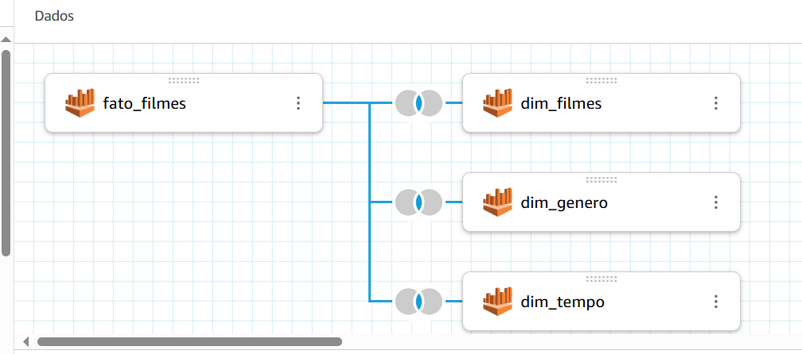
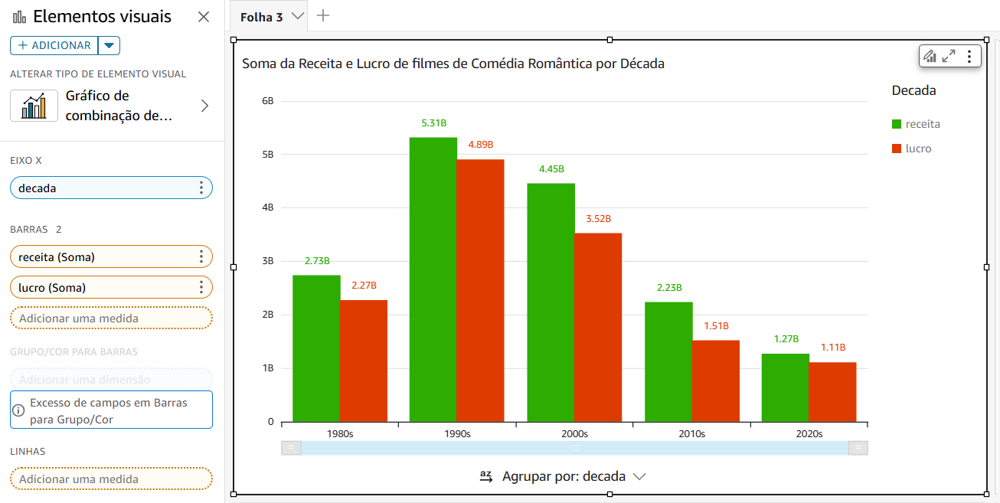
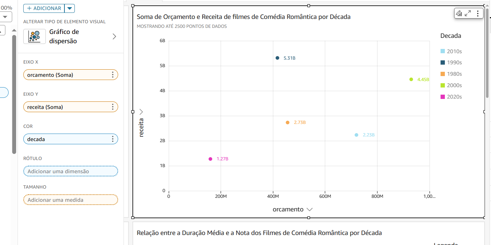
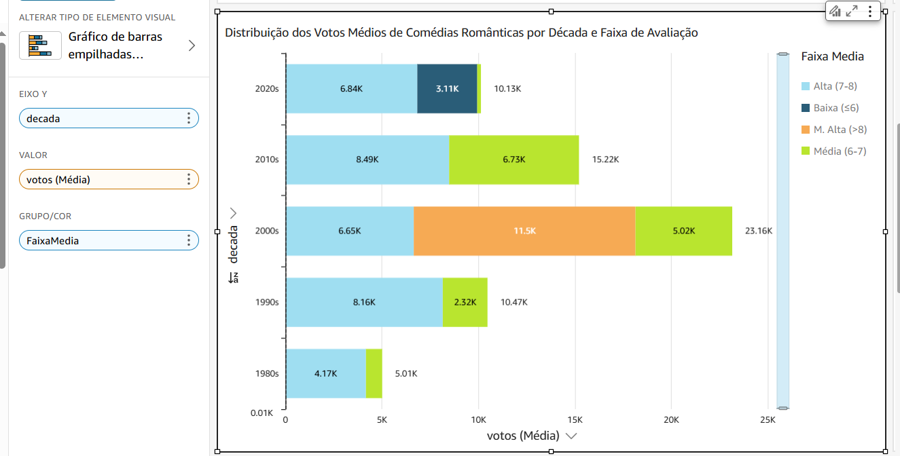
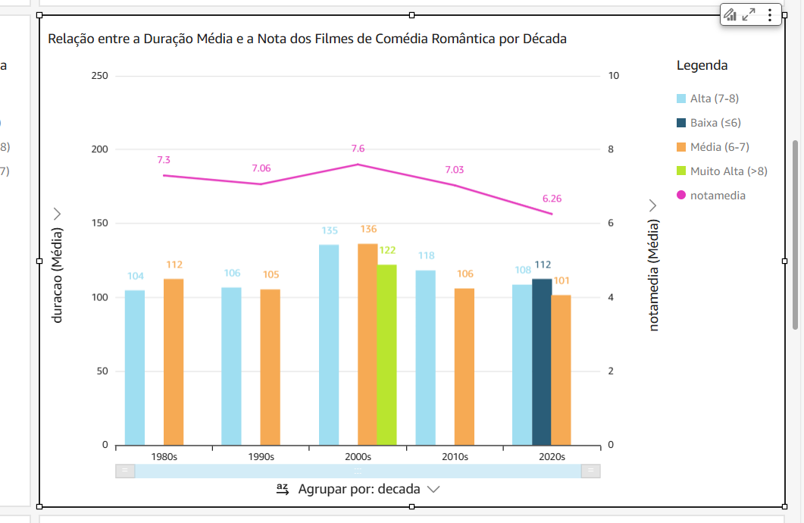
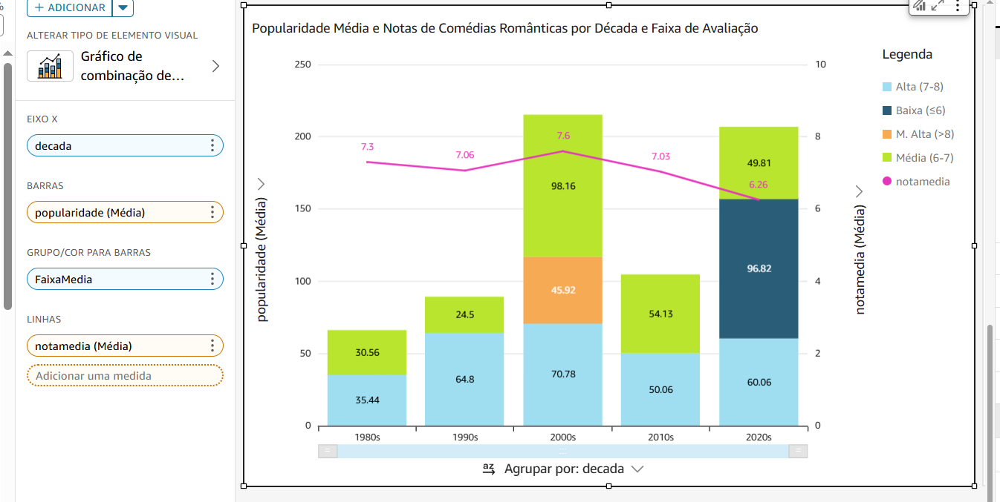

## Análise

Avaliar a evolução dos filmes de comédias românticas entre das décadas de 1980 a 2022, com foco nos três filmes mais bem avaliados de cada década. A análise investigou como receita, lucro, orçamento, popularidade, notas médias, votos e qualidade do filme se comportaram ao longo do tempo e se correlacionaram, revelando tendências e transformações no gênero.

## QUICKSIGHT

1 - Criei a minha conta no QuickSight

2 - Conectei meu banco de dados no Athena e realizei o join entre as tabelas.

## GRÁFICO 1: 

### Tipo do Gráfico: Barras Clusterizadas

### Título: Soma da Receita e Lucro de filmes de Comédia Romântica por Década

### Eixo Y: Decada

### Barras 2 : Receita (soma) e Lucro (soma)

Objetivo: Observar a evolução das receitas e lucros dos filmes de comédia romântica ao longo das décadas, começando nos anos 1980 até 2020.

## GRÁFICO 2: 

### Tipo do Gráfico: Dispersão

### Título: Soma de Orçamento e Receita de filmes de Comédia Romântica por Década

### Eixo X: Orçamento (Soma)

### Eixo Y: Receita (soma)

Objetivo: Demonstrar a relação entre orçamento e receita de filmes de comédia romântica ao longo das décadas.

## GRÁFICO 3: 

### Tipo do Gráfico: Barras Empilhadas Horizontais

### Título: Distribuição dos Votos Médios de Comédias Românticas por Década e Faixa de Avaliação

### Eixo X: Década

### Valor: Votos (Média)

### Grupo/cor: Faixa Média 

Objetivo: Analisar a distribuição dos votos médios atribuídos aos filmes de comédia romântica ao longo das décadas, segmentando-os por faixas de avaliação.

## GRÁFICO 4: 

### Tipo do Gráfico: Barras Clusterizadas

### Título: Relação entre a Duração Média e a Nota dos Filmes de Comédia Romântica por Década

### Eixo X: Década

### Barras: Duração (Média)

### Linhas: Nota Média

Objetivo: Mostrar a duração média dos filmes de comédia romântica por faixa de avaliação (Alta, Média, Baixa, Muito Alta) ao longo das décadas (1980 a 2020). Além disso, a linha de média (notamedia) representa a média geral das notas dos filmes em cada década.

## GRÁFICO 5: 

### Tipo do Gráfico: Barras Empilhadas

### Título: Popularidade Média e Notas de Comédias Românticas por Década e Faixa de Avaliação

### Barras: Popularidade (Média)

### Grupo/cor: Faixa Média

### Linhas: Nota Média

Objetivo: Analisar a relação entre a popularidade média e as notas atribuídas aos filmes de comédia romântica ao longo das décadas, segmentando-os por faixas de avaliação. 

