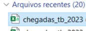
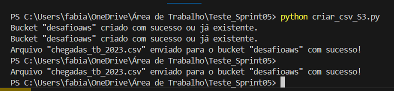
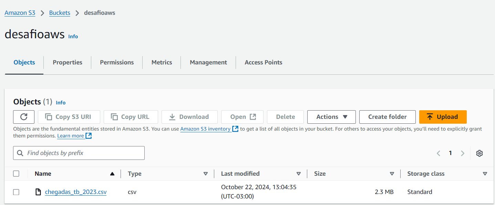
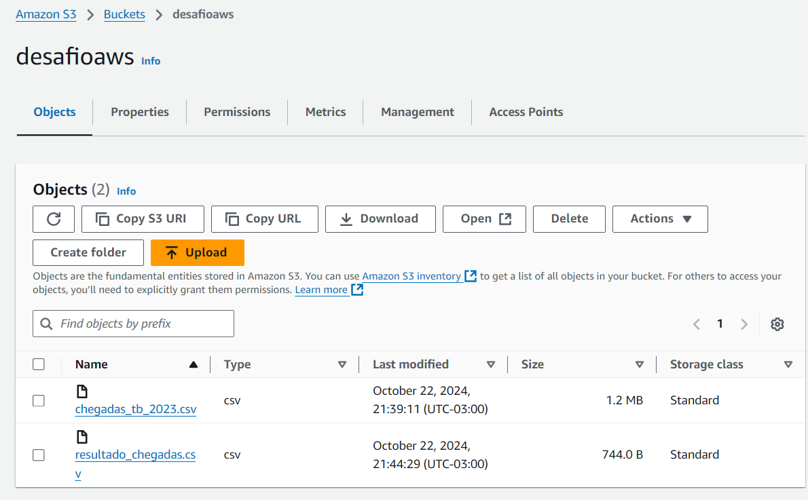
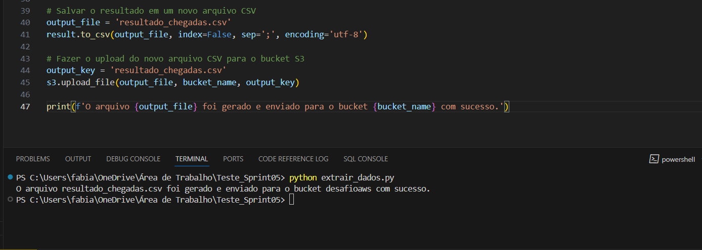

## Instruções 

### Etapa 1: 

1 -Baixei a tabela .csv "Chegadas de Turistas Internacionais 2023" do Portal Brasileiro de Dados Abertos, na seção de Comércio e Serviço, e a renomeei para chegadas_tb_2023.csv.



### Etapa 2: 

## Upload no S3

### 1 - Criei um script em python chamado "criar_csv_S3.py" que inclui as seguintes etapas:

### 1.1 - Importação da Biblioteca:

Importei a biblioteca boto3, que permite interagir com os serviços da AWS.

`import boto3`

### 1.2 - Configuração das Credenciais:

 Introduzi as minhas credenciais temporárias da AWS (ID de acesso, chave secreta e token de sessão) necessárias para autenticar a sessão com o serviço S3.

`aws_access_key_id = `

`aws_secret_access_key = `

`aws_session_token = `

### 1.3 - Criação do Cliente S3:

Criei um cliente S3 utilizando as credenciais configuradas e especifiquei a região us-east-1.

```
s3 = boto3.client(
    's3',
    aws_access_key_id=aws_access_key_id,
    aws_secret_access_key=aws_secret_access_key,
    aws_session_token=aws_session_token,
    region_name='us-east-1'  "
)
```
### 1.4 - Definição do Bucket e Arquivo:

Especifiquei o nome do bucket (desafioaws) e o caminho local do arquivo CSV a ser enviado.

```
bucket = 'desafioaws'
arquivo = r'C:\Users\fabia\OneDrive\Área de Trabalho\Teste_Sprint05\chegadas_tb_2023.csv'
nome_arquivo = 'chegadas_tb_2023.csv'
```

### 1.5 - Criação do Bucket:

Criei o bucket (desafioaws). O programa ignora a operação se o bucket já existir, exibindo uma mensagem de sucesso.



### 1.6 - Upload do Arquivo:

Fiz o upload do arquivo CSV para o bucket S3. O nome do arquivo no S3 é definido como chegadas_tb_2023.csv.

### 1.7 - Tratamento de Erros:

Implementei um bloco try-except para capturar e exibir qualquer erro que ocorra durante a criação do bucket ou o upload do arquivo.



### Etapa 3:

## Processamento de Dados no S3

### 1 - Criei um segundo script em python chamado "extrair_dados.py" que inclui as seguintes etapas:

### 1.1 - Importação de Bibliotecas:

Importei as bibliotecas boto3 para interagir com a AWS e pandas para manipulação de dados.

`import boto3`
`import pandas as pd`

### 1.2 - Configuração do Cliente S3:

Configurei um cliente S3 utilizando as minhas credenciais temporárias para acessar os serviços da AWS.

```
s3 = boto3.client(
    's3',
    aws_access_key_id=
    aws_secret_access_key=
    region_name=
    aws_session_token=
)
 ```   

### 1.3 - Download do Arquivo do S3:

Fiz o download do arquivo chegadas_tb_2023.csv do bucket desafioaws.

 ```
bucket_name = 'desafioaws'
file_name = 'chegadas_tb_2023.csv'
s3.download_file(bucket_name, file_name, file_name)
 ```

### 1.4 -Leitura do Arquivo CSV:

Li o arquivo CSV utilizando pandas, especificando o delimitador ; e a codificação latin1.

`df = pd.read_csv(file_name, delimiter=';', encoding='latin1')`

### 1.5 -Filtragem e Agregação dos Dados:

1.5.1 - Realizei a conversão da coluna data para o formato datetime e converti os nomes dos países para maiúsculas.


1.5.2 - Filtrei os dados para incluir apenas registros do continente europeu, excluindo a Turquia e considerando apenas o mês de julho.


1.5.3 - Agrupei os dados por país e calculei a soma e a média das chegadas.

```
result = (
    df.assign(
        data=pd.to_datetime(df['data'], errors='coerce'),  # Conversão de data
        País=df['País'].str.upper()                           # Conversão para maiúsculas
    )
    .query("Continente == 'Europa' and País != 'TURQUIA' and data.dt.month == 7")  # Filtragem com operadores lógicos
    .groupby('País')  # Agrupamento por País
    .agg(
        total_chegadas=('Chegadas', 'sum'),  # Função de agregação para soma
        media_chegadas=('Chegadas', 'mean')   # Função de agregação para média
    )
    .reset_index()  # Resetando o índice
    .query("total_chegadas > 50")  # Condição similar ao HAVING
)
``` 


### 1.6 - Salvamento do Resultado:

Salvei o resultado filtrado e agregado em um novo arquivo CSV chamado resultado_chegadas.csv, usando ; como delimitador e codificação utf-8.

`output_file = 'resultado_chegadas.csv'`

`result.to_csv(output_file, index=False, sep=';', encoding='utf-8')`


### 1.7 - Upload do Novo Arquivo para o S3:

Fiz o upload do arquivo resultado_chegadas.csv de volta para o bucket desafioaws.

`output_key = 'resultado_chegadas.csv'`

`s3.upload_file(output_file, bucket_name, output_key)`




### 1.8 - Confirmação do Sucesso:

Exibi uma mensagem de sucesso confirmando que o arquivo foi gerado e enviado para o bucket.

`print(f'O arquivo {output_file} foi gerado e enviado para o bucket {bucket_name} com sucesso.')`


