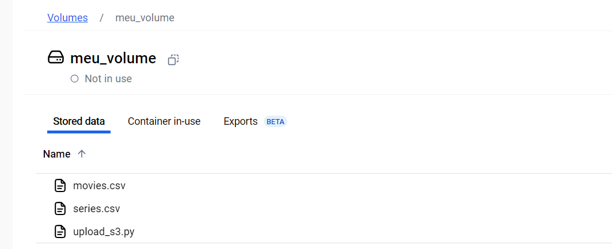

## Instruções: 

### 1 - Baixei as duas tabelas (movies e series) .csv 

### 2 - Criei um script em python chamado "upload_S3.py" que inclui as seguintes etapas:

### 2.1 - Importação da Biblioteca:

Importei a biblioteca boto3, que permite interagir com os serviços da AWS.

`import boto3`

Importei a biblioteca datatime, que permite para trabalhar com datas e horários.

`import datatime`

### 2.2 - Configuração das Credenciais:

 Introduzi as minhas credenciais temporárias da AWS (ID de acesso, chave secreta e token de sessão) necessárias para autenticar a sessão com o serviço S3.

`aws_access_key_id = `

`aws_secret_access_key = `

`aws_session_token = `

### 2.3 - Criação do Cliente S3:

Criei um cliente S3 utilizando as credenciais configuradas e especifiquei a região us-east-1.

```
s3 = boto3.client(
    's3',
    aws_access_key_id=aws_access_key_id,
    aws_secret_access_key=aws_secret_access_key,
    aws_session_token=aws_session_token,
    region_name='us-east-1'  "
)
```
### 2.4 - Nome Bucket e Arquivos:

Chamei o meu bucket de:

`bucket = 'data-lake-de-fabiana' `

Defini uma lista com os caminhos locais dos arquivos que serão enviados para o S3. O caminho /app/movies.csv se refere ao arquivo de filmes e /app/series.csv ao arquivo de séries.

```
arquivos = [
    '/app/movies.csv',
    '/app/series.csv'
]
```

Em seguida, defini os nomes dos arquivos que serão usados ao fazer o upload no S3. Esses são os nomes que os arquivos terão após serem enviados para o bucket. 

```
nomes_arquivos = [
    'filmes.csv',  # Nome para o arquivo de filmes
    'series.csv'   # Nome para o arquivo de séries
]
```

### 2.5 - Obter data atual 

Depois obtir a data atual e extrair o ano, mês e dia de forma formatada:

```
data_atual = datetime.now()
ano = data_atual.strftime('%Y')  # Ano
mes = data_atual.strftime('%m')  # Mês
dia = data_atual.strftime('%d')  # Dia
```

### 3 - Criação Bucket:

Este código tem como objetivo criar um bucket no Amazon S3 (se ainda não existir) e fazer o upload de arquivos CSV de um diretório local para um caminho estruturado no S3, baseado na data atual. Ele cria o bucket, itera sobre os arquivos, define um caminho dinâmico para cada arquivo (incluindo ano, mês e dia) e os envia para o S3. Após o upload, imprime uma mensagem de sucesso para cada arquivo. Caso ocorra um erro, ele é capturado e a mensagem de erro é exibida.


```
try:
    # Criar o bucket (ignorar se o bucket já existir)
    s3.create_bucket(Bucket=bucket)
    print(f'Bucket "{bucket}" criado com sucesso ou já existente.')

    # Iterar sobre os arquivos e fazer o upload
    for arquivo, nome_arquivo in zip(arquivos, nomes_arquivos):
        # Caminho no S3 com a estrutura especificada
        s3_path = f'raw/local/csv/{nome_arquivo[:-4]}/{ano}/{mes}/{dia}/{nome_arquivo}'  # Ajusta o caminho para o padrão
        # Fazer upload do arquivo para o bucket na pasta especificada
        s3.upload_file(arquivo, bucket, s3_path)
        print(f'Arquivo "{nome_arquivo}" enviado para o bucket "{bucket}" em "{s3_path}" com sucesso!')

except Exception as e:
    print(f'Ocorreu um erro: {e}')
```    


### 4 - Dockerfile:

1. Salvei o script upload_S3.py e em seguida:

2. Criei um arquivo Dockerfile para definir como a imagem deve ser construída, detalhando o passo a passo do processo.

3. No Dockerfile, utilizei o comando:

`from python`

`workdir /app`

`COPY upload_s3.py /app/upload_s3.py`

`COPY movies.csv /app/movies.csv`

`COPY series.csv /app/series.csv`

`RUN pip install boto3`

`cmd ["python", "upload_s3.py"]`

4.1 - O comando `from` para indicar que a imagem base para a construção do Docker é uma imagem do Python.

4.2 - O comando `workdir` para definir o diretório de trabalho dentro da imagem Docker.

4.3 - O comando `COPY upload_s3.py` para copiar o arquivo "upload_s3.py" do diretório local para o diretório /app dentro do contêiner.

4.4 - O comando `COPY movies.csv /app/movies.csv` para copiar o arquivo movies.csv do diretório local para o contêiner, no caminho /app/movies.csv. 

4.5 - O comando `COPY series.csv /app/series.csv` para copiar o arquivo series.csv do diretório local para o contêiner, no caminho /app/series.csv.

4.6 - O comando `RUN pip install boto3`  para instalar a biblioteca boto3 dentro do contêiner.

4.7 - O comando `cmd` para especificar o comando que deverá ser executado quando o container for iniciado a partir da imagem. Neste caso, ele executará o interpretador Python e passará o "upload_s3.py" como argumento.

4.8 - 4 - Em seguida, ultilizei o comando `docker build -t s3_imagem` para criar a imagem Docker com o nome "s3_imagem".


4.9 - E por fim, utilizei o comando `docker run s3_imagem` para executar o coitêiner.


### 5 - Volume:

5.1 - Utilizei o comando `docker volume create meu_volume` para criar um volume no Docker chamado meu_volume.


5.2 - Em seguida, utilizei o comando `docker run -v meu_volume:/app s3_imagem` para executar um contêiner da imagem "s3_imagem" e montar o volume "meu_volume" no diretório /app dentro do contêiner.




### 6 - AWS:

1. Após concluir o processo, acessei minha conta na AWS para verificar se o código foi executado com sucesso e se tudo estava conforme o esperado.


### 5 - Análise:


## Análise de Filmes de Comédia Romântica (1984-2022)

### Este análise visa analisar a evolução dos filmes de comédia romântica entre 1984 e 2022, focando em quatro áreas principais:

1. Nota Média por Década: 

Avaliação das mudanças nas notas médias ao longo das décadas.

2. Impacto do Tempo de Filme: 

Análise da relação entre a duração dos filmes e suas notas médias.

3. Idade dos Artistas: 

Estudo de como a idade média dos artistas afeta a avaliação dos filmes.

4. Produção por Década: 

Quantificação dos filmes lançados por década para observar tendências de popularidade.

#### O objetivo é fornecer uma visão geral sobre como a qualidade e popularidade das comédias românticas evoluíram, considerando fatores como a duração dos filmes e a faixa etária dos artistas


