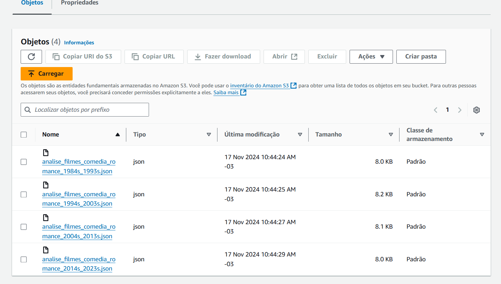

## Análise 

Resumo da Nova Análise:

Objetivo:

Analisar a evolução dos filmes de comédia romântica de 1984 a 2022, investigando a relação entre nota média, popularidade, e duração. O foco é entender como o tempo de duração e a recepção crítica (nota média, popularidade) influenciam o desempenho dos filmes ao longo das décadas.

#### Principais Áreas de Análise:

#### Evolução da Nota Média por Década:
Como as avaliações críticas dos filmes de comédia romântica mudaram ao longo do tempo (1984 a 2022).

#### Impacto da Duração no Desempenho:
Análise da relação entre a duração do filme (tempo de duração) e a nota média. Será investigado se há uma correlação entre filmes mais curtos ou mais longos e as avaliações críticas dos filmes.

#### Popularidade e Nota Média:
Como a popularidade de um filme afeta sua avaliação crítica (nota média). Filmes mais populares recebem notas mais altas ou baixas? Existe algum padrão ao longo das décadas?

#### Produção de Filmes por Década:
Quantidade de filmes de comédia romântica lançados em cada década e análise das tendências de popularidade dentro do gênero.

#### Objetivo Final:
Identificar padrões e fatores que influenciam o sucesso de filmes de comédia romântica, considerando tanto a recepção crítica quanto a popularidade dos filmes ao longo do tempo. A análise vai explorar se a duração dos filmes tem um papel significativo em seu desempenho em termos de crítica e popularidade, além de examinar as mudanças nas tendências de produção e recepção do gênero por década.


## Criar função Lambda 

1 - No console do AWS Lambda, eu selecionei "Criar uma função" e optei por "Author from scratch". Nomeei a função como "sprint7desafio", escolhi Python 3.9 como runtime e cliquei em "Criar".


## Criar um Layer

1 - Criei arquivo Dockerfile com os seguintes comandos:

`FROM amazonlinux:2023`: Define a imagem base como Amazon Linux 2023.

`RUN yum update -y`: Atualiza os pacotes do sistema.

`RUN yum install -y python3-pip zip`: Instala o Python 3.9 e a ferramenta zip.

`RUN yum -y clean all`: Limpa o cache do gerenciador de pacotes para reduzir o tamanho da imagem.


2 - Após isso, executei docker build -t amazonlinuxpython39 . para construir a imagem Docker com o nome amazonlinuxpython39.


3 - Executei o comando abaixo para acessar o shell do container Docker:

`docker run -it amazonlinuxpython39 bash`

Isso abriu o prompt bash-5.2#. Em seguida, criei a estrutura de diretórios necessária para a layer com as bibliotecas:

```
cd ~ – Naveguei para o diretório home.
mkdir layer_dir – Criei a pasta layer_dir.
cd layer_dir/ – Acesse a pasta layer_dir.
mkdir python – Criei a pasta python onde as bibliotecas serão armazenadas.
cd python/ – Acessei a pasta python.
pwd – Verifiquei o diretório atual, que deve ser /root/layer_dir/python.

```
A estrutura final ficou como: /root/layer_dir/python.


4 - Instalei as bibliotecas requests e boto3 na pasta python atraavés do comando: `pip3 install requests boto3 -t .` e, em seguida, compactei a pasta em um arquivo zip com o comando: `zip -r minha-camada-layer.zip .` Para copiar o arquivo para a máquina local e identifiquei o ID do container com `docker container ls`.


5- Após obter o ID do container, usei o seguinte comando para copiar o arquivo minha-camada-layer.zip

`docker cp 50dd8a48256:/root/layer_dir/minha-camada-layer.zip ./ `

6 - Como o arquivo era grande, fiz o upload dele para um bucket S3. Em seguida, no AWS Lambda, fui até a seção Camadas, cliquei em Criar uma camada, dei o nome de "camadazip" e escolhi a opção de fazer upload do arquivo via S3. Copiei a URL do arquivo no S3, colei no campo correspondente e selecionei as opções de arquitetura e runtime. Por fim, cliquei em Criar para finalizar a criação da camada.


## Criar política de permissão

Criei uma política de permissões no AWS IAM que permite ler e escrever objetos no caminho data-lake-de-fabiana/raw/tmdb/json/ do bucket S3. A política concede as permissões s3:GetObject e s3:PutObject para os objetos dentro desse diretório.


## AWS Lambda

1 - Criei um evento de teste no Lambda com um JSON contendo o ano 2024, os gêneros comédia (ID 35) e drama romântico (ID 1049), e a página 1 para filtrar os resultados. Esse evento serve para buscar filmes específicos com base nesses parâmetros.


#### 2- Executei o meu script lamda.py onde:

2.1 - Importei as bibliotecas:

`requests`: Usado para fazer requisições HTTP à API do TMDb.

`json`: Usado para manipular dados no formato JSON.

`os`: Usado para manipulação de arquivos e diretórios.

`time`: Usado para adicionar pausas entre tentativas de requisição.

`boto3`: Usado para interagir com o serviço S3 da AWS.

2.2 - Definição da chave de API:

`api_key`: A chave para autenticação na API do TMDb, necessária para fazer as requisições.

2.3 - Função buscar_detalhes_filme:

```
def buscar_detalhes_filme(movie_id, tentativas=3, delay=5):
    url = f"https://api.themoviedb.org/3/movie/{movie_id}?api_key={api_key}&language=pt-BR"
    for tentativa in range(tentativas):
        try:
            response = requests.get(url)
            response.raise_for_status()  # Levanta um erro se o status code não for 200
            dados = response.json()
            return {
                "nome": dados.get("title"),
                "ano": dados.get("release_date", "")[:4],
                "popularidade": dados.get("popularity"),
                "nota_media": dados.get("vote_average"),
                "votos": dados.get("vote_count"),
                "orcamento": dados.get("budget"),
                "receita": dados.get("revenue"),
                "runtime": dados.get("runtime"),
                "generos": [g["name"] for g in dados.get("genres", [])]
            }
        except requests.exceptions.RequestException as e:
            print(f"Erro ao buscar dados do filme (tentativa {tentativa + 1}): {e}")
            if tentativa < tentativas - 1:
                print(f"Tentando novamente após {delay} segundos...")
                time.sleep(delay)  # Espera antes de tentar novamente
            else:
                print("Falha ao buscar dados após várias tentativas.")
                return None

```

Faz uma requisição à API do TMDb para obter os detalhes de um filme com base no movie_id.
Retorna informações como nome, ano de lançamento, popularidade, notas, votos, orçamento, receita, tempo de execução e gêneros. A função tenta a requisição até 3 vezes, com um intervalo de 5 segundos em caso de falha.

2.4 - Função buscar_filmes_por_decada_genero:

```

def buscar_filmes_por_decada_genero(decada_inicio, decada_fim, generos, page=1, tentativas=3, delay=5):
    filmes = []
    # Buscando filmes entre decada_inicio e decada_fim
    url = f"https://api.themoviedb.org/3/discover/movie?api_key={api_key}&language=pt-BR&primary_release_date.gte={decada_inicio}-01-01&primary_release_date.lte={decada_fim}-12-31&with_genres={generos}&page={page}"
    
    for tentativa in range(tentativas):
        try:
            response = requests.get(url)
            response.raise_for_status()  # Levanta um erro se o status code não for 200
            for item in response.json().get("results", []):
                detalhes = buscar_detalhes_filme(item["id"])
                if detalhes:
                    filmes.append(detalhes)
            return filmes
        except requests.exceptions.RequestException as e:
            print(f"Erro ao buscar filmes para a década {decada_inicio}-{decada_fim} (tentativa {tentativa + 1}): {e}")
            if tentativa < tentativas - 1:
                print(f"Tentando novamente após {delay} segundos...")
                time.sleep(delay)  # Espera antes de tentar novamente
            else:
                print("Falha ao buscar filmes após várias tentativas.")
                return filmes

```

A função busca filmes dentro de um intervalo específico de décadas e com gêneros determinados. Ela utiliza a API do TMDb para filtrar os filmes por data de lançamento e gênero. Para cada filme encontrado, chama a função buscar_detalhes_filme para obter informações adicionais. A requisição é tentada até 3 vezes em caso de falha.

2.5 - Função calcular_media_analise:

```

def calcular_media_analise(filmes):
    if not filmes:
        return {
            "media_popularidade": 0,
            "media_nota": 0,
            "media_votos": 0,
            "media_orcamento": 0,
            "media_receita": 0
        }
    
    total_popularidade = sum([filme["popularidade"] for filme in filmes])
    total_votos = sum([filme["votos"] for filme in filmes])
    media_nota = sum([filme["nota_media"] for filme in filmes]) / len(filmes)
    total_orcamento = sum([filme["orcamento"] for filme in filmes if filme["orcamento"] > 0])
    total_receita = sum([filme["receita"] for filme in filmes if filme["receita"] > 0])
    
    return {
        "media_popularidade": total_popularidade / len(filmes),
        "media_votos": total_votos / len(filmes),
        "media_nota": media_nota,
        "media_orcamento": total_orcamento / len(filmes) if total_orcamento > 0 else 0,
        "media_receita": total_receita / len(filmes) if total_receita > 0 else 0
    }

```

A função recebe uma lista de filmes e calcula a média de vários parâmetros, como popularidade, votos, nota média, orçamento e receita. Ela retorna um dicionário com as médias calculadas para cada um desses parâmetros.

2.6 - Função salvar_analise_por_decada:

```
def salvar_analise_por_decada(decada_inicio, decada_fim, filmes, analise):
    # Diretório onde os arquivos JSON serão salvos
    output_dir = '/tmp/analises_por_decada'  # Usando /tmp para Lambda (no ambiente AWS Lambda, /tmp é o único diretório gravável)
    os.makedirs(output_dir, exist_ok=True)

    dados_analise = {
        "decada": f"{decada_inicio}s",
        "total_filmes_encontrados": len(filmes),
        "media_popularidade": analise["media_popularidade"],
        "media_votos": analise["media_votos"],
        "media_nota": analise["media_nota"],
        "media_orcamento": analise["media_orcamento"],
        "media_receita": analise["media_receita"],
        "filmes_comedia_romance": filmes
    }

    # Salvando os dados no formato de arquivo JSON para a década específica
    file_path = os.path.join(output_dir, f"analise_filmes_comedia_romance_{decada_inicio}s_{decada_fim}s.json")
    with open(file_path, "w", encoding="utf-8") as json_file:
        json.dump(dados_analise, json_file, ensure_ascii=False, indent=4)

    print(f"Análise para a década de {decada_inicio}-{decada_fim} salva localmente em '{file_path}'")

    # Agora, fazer o upload do arquivo para o S3
    s3 = boto3.client('s3')
    bucket_name = 'data-lake-de-fabiana'  # Substitua com o nome do seu bucket S3

    # Caminho do arquivo no S3
    s3_key = f"raw/tmdb/json/2024/11/17/{os.path.basename(file_path)}"
    
    try:
        s3.upload_file(file_path, bucket_name, s3_key)
        print(f"Arquivo enviado para o S3 com sucesso: s3://{bucket_name}/{s3_key}")
    except Exception as e:
        print(f"Erro ao enviar o arquivo para o S3: {e}")

```

A função cria um diretório temporário (/tmp/analises_por_decada) no ambiente Lambda para salvar os arquivos JSON. Ela armazena os resultados da análise, incluindo médias e filmes encontrados, em um arquivo JSON. Em seguida, faz o upload desse arquivo JSON para um bucket S3 especificado, utilizando a biblioteca boto3.

2.7 - Função lambda_handler:

```

def lambda_handler(event, context):
    # Loop para percorrer as décadas de 1980 a 2020
    for decada_inicio in range(1984, 2023, 10):
        decada_fim = decada_inicio + 9
        filmes_comedia_romance = buscar_filmes_por_decada_genero(decada_inicio, decada_fim, generos_comedia_romance)
        analise = calcular_media_analise(filmes_comedia_romance)
        
        # Salvar os dados da análise para a década e fazer upload para o S3
        salvar_analise_por_decada(decada_inicio, decada_fim, filmes_comedia_romance, analise)

    return {
        'statusCode': 200,
        'body': json.dumps('Processamento concluído com sucesso!')
    }

```

A função principal, chamada pelo AWS Lambda, itera por décadas de 1980 a 2020, utilizando a função buscar_filmes_por_decada_genero para encontrar filmes de comédia e romance em cada década. Em seguida, calcula as médias de cada década com a função calcular_media_analise e chama salvar_analise_por_decada para salvar e enviar os resultados para o S3.


## S3 

1 - Por fim, acessei o AWS S3 para verificar os arquivos no meu data lake, e o objetivo foi concluído com sucesso.


