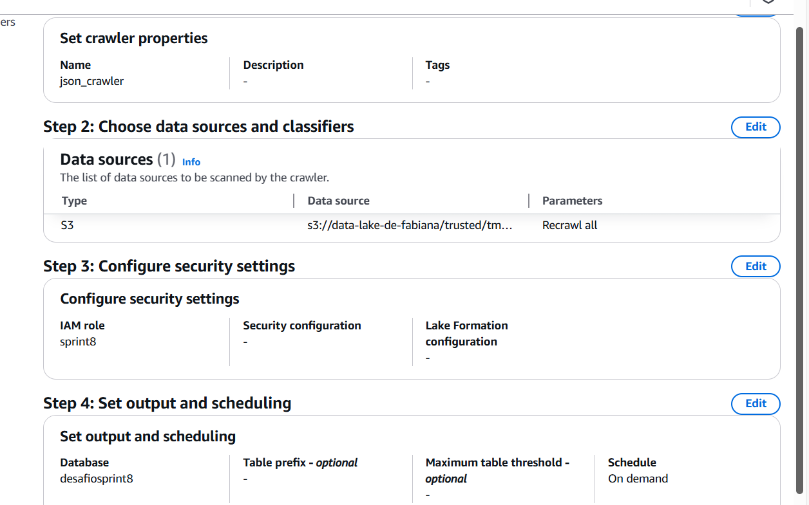

## Análise 

Resumo da Análise:

Objetivo:

Analisar a evolução dos filmes de comédia romântica de 1984 a 2022, investigando a relação entre nota média, popularidade, e duração. O foco é entender como o tempo de duração e a recepção crítica (nota média, popularidade) influenciam o desempenho dos filmes ao longo das décadas.

#### Principais Áreas de Análise:

#### Evolução da Nota Média por Década:
Como as avaliações críticas dos filmes de comédia romântica mudaram ao longo do tempo (1984 a 2022).

#### Impacto da Duração no Desempenho:
Análise da relação entre a duração do filme (tempo de duração) e a nota média. Será investigado se há uma correlação entre filmes mais curtos ou mais longos e as avaliações críticas dos filmes.

#### Popularidade e Nota Média:
Como a popularidade de um filme afeta sua avaliação crítica (nota média). Filmes mais populares recebem notas mais altas ou baixas? Existe algum padrão ao longo das décadas?

#### Produção de Filmes por Década:
Quantidade de filmes de comédia romântica lançados em cada década e análise das tendências de popularidade dentro do gênero.

#### Objetivo Final:
Identificar padrões e fatores que influenciam o sucesso de filmes de comédia romântica, considerando tanto a recepção crítica quanto a popularidade dos filmes ao longo do tempo. A análise vai explorar se a duração dos filmes tem um papel significativo em seu desempenho em termos de crítica e popularidade, além de examinar as mudanças nas tendências de produção e recepção do gênero por década.

## Criar um job AWS GLUE (CSV)

1- Criei um job chamado `sprint8` em um script Spark no editor do AWS Glue para acessar e processar meu arquivo .csv na camada Raw do S3. O job transformou os dados em formato Parquet e os armazenou na camada Trusted, garantindo que estivessem prontos para análise.


## AWS IAM

Criei uma função no AWS IAM chamada `sprint8`  e configurei permissões com políticas como AmazonS3FullAccess, AmazonS3ReadOnlyAccess, AWSGlueConsoleFullAccess e AWSGlueServiceRole. Adicionei uma política em linha chamada ` desafiosprint8`  que permitiu acessar e manipular arquivos nas camadas Raw e de transformação no S3. Também autorizei ações no AWS Glue para gerenciar tabelas e bancos de dados específicos e para iniciar e monitorar o job DataProcessingJob.


## AWS Job Details

Fiz as seguintes configurações para o job no AWS Glue: selecionei a função IAM criada: `sprint8`. Defini o tipo como Spark. Para a versão do Glue, escolhi 3.0 e usei a linguagem Python 3.0. O tipo de worker foi configurado como Gx1 e solicitei 2 workers. Além disso, defini o tempo de execução do job como 60 minutos.


## AWS Job Parameters

Nos parâmetros do job, defini o input como o local de origem dos dados que serão processados pelo job, e o target como o destino para onde os dados processados serão armazenados.


## Script csv (sprint8)

### 1 - Importei as bibliotecas: 

```
sys, datetime, awsglue.transforms, awsglue.utils, pyspark.context, awsglue.context, awsglue.job, awsglue.dynamicframe e pyspark.sql.functions.

```
Pois são bibliotecas essenciais para a execução de um job no AWS Glue, incluindo módulos para manipulação de argumentos (sys e awsglue.utils), gerenciamento de datas (datetime) e configuração do contexto Spark (pyspark.context e awsglue.context). Ele utiliza Job para controlar a execução do job e DynamicFrame para processar dados de forma flexível. Além disso, funções do pyspark.sql.functions como when, col, lower e trim são usadas para transformar os dados durante o processamento.

### 2 - Receber o nome do job e os caminhos S3

`args = getResolvedOptions(sys.argv, ['JOB_NAME', 'S3_INPUT_PATH', 'S3_TARGET_PATH'])`

O código usa a função getResolvedOptions para obter os argumentos necessários ao job: o nome do job (JOB_NAME), o caminho do arquivo de entrada no S3 (S3_INPUT_PATH) e o destino no S3 para armazenar os dados processados (S3_TARGET_PATH).

### 3 - Inicializar o Glue Context e caminhos de entrada e saída 


```
sc = SparkContext()
glueContext = GlueContext(sc)
spark = glueContext.spark_session
job = Job(glueContext)
job.init(args['JOB_NAME'], args)

# Caminhos de entrada e saída
source_file = args['S3_INPUT_PATH']
target_path = args['S3_TARGET_PATH']

```

O código inicializa o SparkContext e o GlueContext para gerenciar o job no AWS Glue, configurando a sessão Spark e o job com o nome definido em JOB_NAME. Os caminhos de entrada e saída fornecidos em S3_INPUT_PATH e S3_TARGET_PATH são atribuídos às variáveis source_file e target_path para processamento.

### 4 - Ler o arquivo CSV como DynamicFrame e converte para Dataframe

```
df = glueContext.create_dynamic_frame.from_options(
    connection_type="s3",
    connection_options={"paths": [source_file]},
    format="csv",
    format_options={"withHeader": True, "separator": "|"}
)

# Converter o DynamicFrame para DataFrame para transformações
raw_data = df.toDF()

```
O código lê o arquivo CSV do S3 a partir de source_file como um DynamicFrame, configurando o formato com cabeçalho e separador |. Depois, converte o DynamicFrame para um DataFrame Spark em raw_data, permitindo as transformações.

### 5 - Tratamento e Normalização

```
# Substitui zeros por null em todas as colunas
df_no_zeros = raw_data.select(
    [when(col(c) == 0, None).otherwise(col(c)).alias(c) for c in raw_data.columns]
)

# Normaliza as colunas de textos
for col_name in df_no_zeros.columns:
    if dict(df_no_zeros.dtypes)[col_name] == 'string':
        df_no_zeros = df_no_zeros.withColumn(col_name, trim(lower(col(col_name))))

# Remove as duplicatas
df_cleaned = df_no_zeros.dropDuplicates()

# Remove colunas de particionamento indesejadas
columns_to_remove = ['partition_0', 'partition_1', 'partition_2', 'partition_3']
df_cleaned = df_cleaned.drop(*columns_to_remove)

# Remove linhas com valores nulos (se necessário)
df_cleaned = df_cleaned.na.drop()

# Converte de volta para DynamicFrame
clean_data = DynamicFrame.fromDF(df_cleaned, glueContext, "clean_data")

```
O código começa normalizando as colunas de texto, aplicando a função trim e lower para remover espaços e converter o texto para minúsculas. Em seguida, remove duplicatas com dropDuplicates e exclui colunas de particionamento desnecessárias, como partition_0, partition_1, etc. Depois, elimina as linhas com valores nulos usando na.drop(). Por fim, converte o DataFrame limpo de volta para um DynamicFrame para ser usado no Glue.

### 6 - Obter data atual e contruir caminho de saída

```
# Obter a data atual para a estrutura de diretórios
current_date = datetime.now()
year = current_date.year
month = str(current_date.month).zfill(2)  
day = str(current_date.day).zfill(2)

# Construi o caminho de saída com a estrutura desejada
output_path = f"{target_path}/filmes/{year}/{month}/{day}"

```
O código obtém a data atual e formata o ano, mês e dia da execução. Em seguida, constrói o caminho de saída output_path, combinando o caminho de destino base target_path com o ano, mês e dia em que o processo foi executado.

### 7 - Salva os dados limpos em Parquet e finaliza o job

```
# Salva os dados limpos no formato Parquet
glueContext.write_dynamic_frame.from_options(
    frame=clean_data,
    connection_type="s3",
    connection_options={"path": output_path},
    format="parquet"
)

# Finaliza o Job
job.commit()

```

O código salva os dados limpos no formato Parquet no caminho de saída especificado em output_path, usando o glueContext. Em seguida, finaliza a execução do job com o comando job.commit().


## S3

Os arquivos CSV, após serem processados e convertidos para o formato Parquet, foram salvos na camada trusted do Data Lake.


## Crawler

Criei um crawler chamado `csv_crawler` para explorar o caminho s3://data-lake-de-fabiana/trusted/csv/ na camada trusted do S3. Configurei o crawler para usar a IAM role `sprint8` e criei a base de dados `desafiosprint8` no Glue Data Catalog e o executei.


## Tabela

A tabela csv foi criada.


## AWS Athena


## Criar um job AWS GLUE (Json)

1- Criei um job chamado `sprint8jason` em um script Spark no editor do AWS Glue para acessar e processar meu arquivo json na camada Raw do S3. O job transformou os dados em formato Parquet e os armazenou na camada Trusted, garantindo que estivessem prontos para análise.


## AWS IAM

Utilizei a função `sprint8` mencionada no passo anterior, aplicando as mesmas políticas de permissão.

## AWS Job Details

Realizei as mesmas configurações descritas anteriormente para o job no AWS Glue: selecionei a função IAM `sprint8`, defini o tipo como Spark e escolhi a versão do Glue 3.0, utilizando a linguagem Python 3.0. Configurei o tipo de worker como Gx1 com 2 workers e defini o tempo de execução do job para 60 minutos.

## AWS Job Parameters

Nos parâmetros do job, segui o mesmo processo mencionado anteriormente: defini o input como o local de origem dos dados a serem processados pelo job e o target como o destino onde os dados processados serão armazenados.

## Script (sprint8jason)

### 1 - Importei as bibliotecas: 

```

import sys ,from awsglue.transforms import * , from awsglue.utils import getResolvedOptions ,from pyspark.context import SparkContext
from awsglue.context import GlueContext , from awsglue.job import Job e 
from pyspark.sql.functions import current_date, year, month, dayofmonth, explode, col

```

As bibliotecas foram importadas para configurar o job no AWS Glue, gerenciar o contexto do Spark, transformar dados, acessar parâmetros do job e realizar manipulações eficientes em DataFrames, como manipulação de colunas e datas.

### 2 - Receber o nome do job e os caminhos S3

 `args = getResolvedOptions(sys.argv, ['JOB_NAME', 'S3_INPUT_PATH', 'S3_TARGET_PATH']) `

Este código tem o objetivo de obter e resolver os parâmetros de entrada do job do AWS Glue, permitindo o uso de variáveis como o nome do job e os caminhos de entrada e saída do S3.

### 3 - Inicializar o Glue Context e caminhos de entrada e saída 

```
sc = SparkContext()
glueContext = GlueContext(sc)
spark = glueContext.spark_session
job = Job(glueContext)
job.init(args['JOB_NAME'], args)

# Caminhos de entrada e saída
source_file = args['S3_INPUT_PATH']
target_path = args['S3_TARGET_PATH']

```
O código inicializa o SparkContext e o GlueContext para gerenciar o job no AWS Glue, configurando a sessão Spark e o job com o nome definido em JOB_NAME. Os caminhos de entrada e saída fornecidos em S3_INPUT_PATH e S3_TARGET_PATH são atribuídos às variáveis source_file e target_path para processamento.

### 4 - Ler o arquivo Json como DynamicFrame e converte para Dataframe

```
df = glueContext.create_dynamic_frame.from_options(
    connection_type="s3",
    connection_options={"paths": [source_file]},
    format="json"
)

# Converte o DynamicFrame para DataFrame 
dataframe = df.toDF()

```
Este código lê um arquivo JSON do S3 e o converte em um DynamicFrame, que é então transformado em um DataFrame do PySpark para análise e manipulação de dados.

### 5 - Verificar DataFrame, adicionar coluna data atual e explodir lista de filmes em linhas

```
# Verifica o schema do DataFrame para garantir que todas as colunas estejam como desejado
dataframe.printSchema()

# Adicionar uma coluna 'data_criacao' com a data atual formatada como 'YYYY/MM/DD'
dataframe = dataframe.withColumn("data_criacao", current_date())

# Explodir a lista de filmes em várias linhas
dataframe_exploded = dataframe.withColumn("filme", explode(col("filmes_comedia_romance")))

```

Este código verifica o esquema do DataFrame para garantir que as colunas estejam configuradas corretamente, adiciona uma coluna chamada data_criacao com a data atual formatada como 'YYYY/MM/DD' e explode a coluna filmes_comedia_romance para criar várias linhas a partir de uma lista de filmes.

### 6 - Criar colunas individuais de filmes 

```
# Seleciona e cria colunas individuais da estrutura interna de 'filme'
dataframe_normalized = dataframe_exploded.select(
    col("filme.nome").alias("nome"),
    col("filme.ano").alias("ano"),
    col("filme.popularidade").alias("popularidade"),
    col("filme.nota_media").alias("nota_media"),
    col("filme.votos").alias("votos"),
    col("filme.orcamento").alias("orcamento"),
    col("filme.receita").alias("receita"),
    col("filme.runtime").alias("runtime"),
    col("filme.generos").alias("generos"),
    col("data_criacao")
)

```
Este código seleciona e cria colunas individuais a partir da estrutura interna da coluna filme no DataFrame explode. Ele extrai os campos nome, ano, popularidade, nota_media, votos, orcamento, receita, runtime e generos da coluna filme e os renomeia de forma apropriada. Além disso, mantém a coluna data_criacao no DataFrame resultante, criando um novo DataFrame chamado dataframe_normalized com essas colunas específicas.

### 7 - Obter ano, mês e dia para compor o caminho 

```
# Obtem valores de ano, mês e dia como strings para compor o caminho
year_value = dataframe_normalized.select(year(dataframe_normalized["data_criacao"])).distinct().collect()[0][0]
month_value = dataframe_normalized.select(month(dataframe_normalized["data_criacao"])).distinct().collect()[0][0]
day_value = dataframe_normalized.select(dayofmonth(dataframe_normalized["data_criacao"])).distinct().collect()[0][0]

```

Este código extrai os valores de ano, mês e dia da coluna data_criacao do DataFrame e os armazena como strings para formar um caminho de diretório, usando year(), month() e dayofmonth() seguidos de collect() para obter os resultados únicos.

## 8 - Caminho final, salvar em Parquet e finalizar o job

```
output_path = f"{target_path}/parquet/{year_value:04d}/{month_value:02d}/{day_value:02d}"

# Salvar os dados em Parquet
dataframe_normalized.write.mode("overwrite").parquet(output_path)

# Finalizar o Job
job.commit()

```

Este código define um caminho de saída para salvar os dados em formato Parquet, escreve o DataFrame no caminho usando o modo "overwrite" e finaliza o job com job.commit().


## S3

Os arquivos Json, após serem processados e convertidos para o formato Parquet, foram salvos na camada trusted do Data Lake.


## Crawler

Criei um crawler chamado `json_crawler` para explorar o caminho s3://data-lake-de-fabiana/trusted/tmdb/ na camada trusted do S3. Configurei o crawler para usar a IAM role `sprint8` e criei a base de dados `desafiosprint8` no Glue Data Catalog e o executei.




## Tabela

A tabela tmdb foi criada


## AWS Athena


