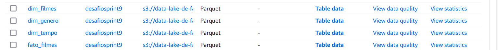

## Criar um job AWS GLUE 

1- Criei um job chamado `modelo dimensional` no AWS Glue para acessar e processar os arquivos da camada Trusted no S3. O job gerou tabelas baseadas no modelo dimensional e as armazenou no formato PARQUET, de forma particionada, na camada Refined, atendendo às necessidades de visualização e extração de insights.


## AWS IAM

Criei um usuário no AWS IAM chamado `desafio` e configurei permissões com políticas como AmazonS3FullAccess e AWSGlueConsoleFullAccess. Além disso, adicionei uma política em linha chamada `dataLake_sprint9`, que tem como objetivo definir permissões limitadas de leitura e gravação nos serviços Athena, Glue, QuickSight e S3, garantindo um acesso controlado a vários recursos para tarefas específicas.


## AWS Job Details

Fiz as seguintes configurações para o job no AWS Glue: selecionei a função IAM criada: `desafio`. Defini o tipo como Spark. Para a versão do Glue, escolhi 3.0 e usei a linguagem Python 3.0. O tipo de worker foi configurado como Gx1 e solicitei 2 workers. Além disso, defini o tempo de execução do job como 60 minutos.


## Script 

### 1 - Importei as bibliotecas: 

```
import sys
from pyspark.context import SparkContext
from awsglue.context import GlueContext
from awsglue.job import Job
from pyspark.sql import functions as F
from pyspark.sql import Window
from pyspark.sql import SparkSession
from pyspark.sql.types import StringType  
import datetime
```

Eu importei essas bibliotecas para configurar o ambiente de processamento de dados usando o Spark e o AWS Glue. O SparkContext e o SparkSession foram usados para configurar o ambiente do Spark, enquanto o GlueContext e o Job permitem gerenciar e executar o job no AWS Glue. A biblioteca functions foi aplicada para realizar transformações e manipulação de dados, a Window foi utilizada para definir janelas de ordenação e particionamento, o StringType foi usado para especificar o tipo de dado das colunas, e a datetime foi importante para trabalhar com datas durante o processamento.

### Criar o contexto do Glue

```
sc = SparkContext()
glueContext = GlueContext(sc)
spark = glueContext.spark_session
job = Job(glueContext)
```
Iniciei o SparkContext para configurar o ambiente do Spark e criei o GlueContext para integrar o AWS Glue com o Spark. Depois, obtive a sessão do Spark e configurei o Job para gerenciar e executar o processamento de dados.

### Acessar os arquivos Parquet diretamente do bucket S3

```
csv_df = spark.read.option("header", "true").parquet("s3://data-lake-de-fabiana/trusted/csv/filmes/2024/12/06/")
tmdb_df = spark.read.option("header", "true").parquet("s3://data-lake-de-fabiana/trusted/tmdb/parquet/2024/12/06/")
```

Li os arquivos parquet de dois caminhos no meu S3, considerando a primeira linha como cabeçalho, e armazenei os dados nas variáveis csv_df e tmdb_df.


### Renomeei colunas para evitar ambiguidades após o JOIN e realizei o JOIN

```
csv_df = csv_df.withColumnRenamed("popularidade", "csv_popularidade")
tmdb_df = tmdb_df.withColumnRenamed("popularidade", "tmdb_popularidade")
tmdb_df = tmdb_df.withColumnRenamed("generos", "tmdb_generos")
csv_df = csv_df.withColumnRenamed("genero", "csv_genero")
joined_df = csv_df.join(
    tmdb_df,
    (F.lower(F.trim(csv_df['tituloPincipal'])) == F.lower(F.trim(tmdb_df['nome']))),
    'inner'
)

```
Renomeei algumas colunas nos DataFrames csv_df e tmdb_df para evitar conflitos e fiz um join entre eles com base na comparação dos títulos (ignorando maiúsculas e espaços extras), armazenando o resultado em joined_df.

### Criando a coluna decada

```
final_df = joined_df.withColumn(
    'decada',
    (F.floor(F.col('anoLancamento').cast('int') / 10) * 10)
)
```

Criei a coluna decada no DataFrame joined_df usando o valor de anoLancamento, arredondado para a década mais próxima, dividindo o ano por 10, arredondando para baixo e multiplicando por 10.

###  Filtrando os filmes para incluir apenas aqueles com os gêneros "comédia" e "romance" e com anos de lançamento entre 1984 e 2022.

```
filtered_df = final_df.filter(
    (F.lower(F.col('csv_genero')).contains('comedy')) & 
    (F.lower(F.col('csv_genero')).contains('romance')) &
    (F.col('anoLancamento').cast('int').between(1984, 2022)) 
)
```
Filtrei o DataFrame final_df para incluir apenas filmes que contêm os gêneros "comedy" e "romance" na coluna csv_genero, e cujo anoLancamento está entre 1984 e 2022.

### Criando uma janela para agrupar por década e ordenar pela nota média e popularidade e adicionando a classificação de filmes por década.

```
window_spec = Window.partitionBy("decada").orderBy(
    F.desc("notaMedia"), 
    F.desc("tmdb_popularidade")
)
ranked_df = filtered_df.withColumn("rank", F.row_number().over(window_spec))
```

Eu criei uma classificação dos filmes por década, ordenando-os pela nota média e popularidade.

### Filtrando apenas os 3 filmes mais bem avaliados por década e criando a tabela de dimensão de filmes (id, nome, e duração)

```
top_filmes = ranked_df.filter(F.col("rank") <= 3)

dim_filmes = top_filmes.filter(F.col('runtime') != 0).select(
    F.col('titulopincipal').alias('titulo'),
    F.col('runtime').alias('duracao')
).dropDuplicates(['titulo'])

dim_filmes = dim_filmes.withColumn("dim_filme_id", F.monotonically_increasing_id())

```

Filtrei os três melhores filmes de cada década e, em seguida, criei uma tabela de dimensão de filmes, contendo o título e a duração. Também removi duplicatas para garantir que cada título aparecesse apenas uma vez e adicionei um ID único para cada filme.

### Criando a tabela de dimensão de gênero, garantindo que "comédia" e "romance" sempre estivessem presentes, sem dividir os gêneros.

```
def garantir_comedia_romance(generos):
    generos = generos.split(',')  
    if 'comedy' not in generos:
        generos.append('comedy')  
    if 'romance' not in generos:
        generos.append('romance')  
    return ','.join(generos) 

```

A função garantir_comedia_romance foi criada para garantir que os gêneros "comédia" e "romance" estivessem presentes em uma lista de gêneros. Se algum desses gêneros estiver faltando, ele será adicionado. O resultado final é uma string com os gêneros separados por vírgula.

### Transformar a função em uma UDF para ser usada nas transformações do DataFrame.

```
garantir_comedia_romance_udf = F.udf(garantir_comedia_romance, StringType())  # Corrigido: usou StringType importado

dim_genero = top_filmes.withColumn(
    'csv_genero', 
    garantir_comedia_romance_udf(F.col('csv_genero'))
)

```

Registrei a função garantir_comedia_romance como uma UDF para garantir que os gêneros "comedy" e "romance" estivessem presentes na coluna csv_genero de cada filme. Apliquei essa UDF ao DataFrame top_filmes para garantir que todos os filmes tivessem esses dois gêneros, se não estivessem presentes.

### Dividindo a coluna 'csv_genero' em uma lista, explodindo a lista para criando uma linha por gênero e, por fim, removendo duplicatas.

```
dim_genero = dim_genero.withColumn(
    'genero_lista', 
    F.split(F.col('csv_genero'), ',')  # Dividindo a coluna 'csv_genero' por vírgula
)

dim_genero = dim_genero.withColumn(
    'genero', 
    F.explode(F.col('genero_lista'))  # Explodindo para gerar uma linha para cada gênero
)

dim_genero = dim_genero.select('genero').dropDuplicates()

```

Separei a coluna 'csv_genero' em uma lista de gêneros, criei uma linha para cada gênero e eliminei as duplicatas.

### Adicionando ID único para a tabela de dimensão de gênero.

```
dim_genero = dim_genero.withColumn(
    "dim_genero_id", F.monotonically_increasing_id()
)

```
Adicionei um identificador único para cada linha na tabela  `dim_genero `.

### Criando a tabela de dimensão de tempo, convertendo 'ano' e 'decada' para inteiro.

```
dim_tempo = top_filmes.select(
    F.col('anoLancamento').alias('ano')
).dropDuplicates().withColumn(
    'decada',
    (F.floor(F.col('ano').cast('int') / 10) * 10)
).withColumn("dim_tempo_id", F.monotonically_increasing_id()) \
   .withColumn('ano', F.col('ano').cast('int')) \
   .withColumn('decada', F.col('decada').cast('int'))

```
Separei a coluna 'anoLancamento' em anos distintos, criei uma nova coluna para calcular a década de cada ano e eliminei as duplicatas. Além disso, adicionei um identificador único para cada linha e converti as colunas 'ano' e 'decada' para o tipo inteiro.

### Criando a tabela de fato de filmes e adicionando o campo id_fato.

```
fato_filmes = top_filmes.join(dim_tempo, "decada").join(
    dim_filmes,
    (top_filmes['titulopincipal'] == dim_filmes['titulo']),
    "inner"
).join(
    dim_genero,
    (top_filmes['csv_genero'] == dim_genero['genero']),
    "inner"
).select(
    dim_tempo["dim_tempo_id"],
    dim_filmes["dim_filme_id"],
    dim_genero["dim_genero_id"],  
    F.col('tmdb_popularidade').alias('popularidade').cast('float'),
    F.col('notaMedia').alias('notaMedia').cast('float')
)

fato_filmes = fato_filmes.withColumn("id_fato", F.monotonically_increasing_id())

```
Separei a tabela de filmes com base em três dimensões: tempo, filmes e gênero. Realizei uma junção entre as tabelas top_filmes, dim_tempo, dim_filmes e dim_genero usando as colunas correspondentes para combinar as informações. Selecionei as colunas necessárias, renomeei algumas delas, converti para o tipo adequado e, por fim, adicionei uma coluna de identificador único chamada "id_fato".

### Obtendo a data atual no formato ano/mes/dia.

```
current_date = datetime.datetime.now().strftime("%Y/%m/%d")

```
Obtive a data atual no formato "ano/mês/dia.

### Definindo os caminhos de saída com base na data atual e salvando as tabelas fato e dimensões em PARQUET.

```
output_dim_filmes_path = f"s3://data-lake-de-fabiana/refined/dim_filmes/{current_date}/"
output_dim_tempo_path = f"s3://data-lake-de-fabiana/refined/dim_tempo/{current_date}/"
output_fato_filmes_path = f"s3://data-lake-de-fabiana/refined/fato_filmes/{current_date}/"
output_dim_genero_path = f"s3://data-lake-de-fabiana/refined/dim_genero/{current_date}/"  # Caminho para dim_genero

dim_filmes.write.mode("overwrite").parquet(output_dim_filmes_path)
dim_tempo.write.mode("overwrite").parquet(output_dim_tempo_path)
fato_filmes.write.mode("overwrite").parquet(output_fato_filmes_path)
dim_genero.write.mode("overwrite").parquet(output_dim_genero_path)  # Salvando a tabela dim_genero

print(f"Tabelas de dimensões e fato salvas com sucesso em {current_date}.")

```
Salvei as tabelas dim_filmes, dim_tempo, fato_filmes e dim_genero no formato Parquet em caminhos específicos no Amazon S3, utilizando a data atual no nome da pasta (Refined). Além disso, configurei a sobrescrição dos dados existentes e imprimi uma mensagem de sucesso.


### Crawler

Criei um crawler chamado `modelo_dimensional` para explorar o caminho s3://data-lake-de-fabiana/refined/ na camada refined do S3. Configurei o crawler para usar a IAM role `desafio` e criei a base de dados `desafiosprint9` no Glue Data Catalog e o executei.


### Tabela

Foram criadas as tabelas: dim_filmes, dim_tempo, dim_genero, fato_filmes. 



### AWS Athena


